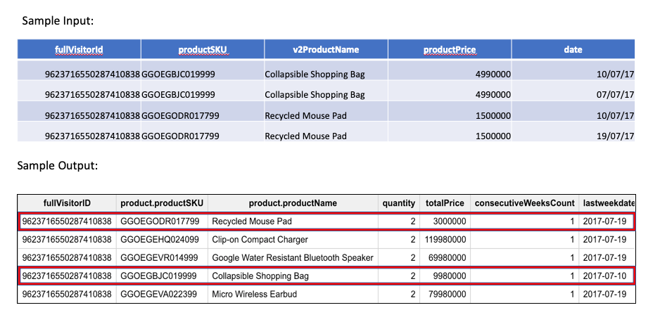

# Aliz Tech Challenge 1

## Problem Statement :

We store 4 billion 32 bit (integer) numbers in a file. It does not matter, whether it is text or binary. Every number occurs only once and the file is unordered. Give an algorithm, which searches for any 32 bit number, that can not be found in the file. 


### Solution :


#### Solution 1 : Suitable for enough Memory Available & Lesser Disk I/O performance

* The input file has 4 billion 32 bit integer numbers.

* To store a 32 bit integer number , it takes 4 bytes. So to store the whole input file in memory, we need 4000000000*4 bytes i.e 16gb (approx) which is a huge memory to load the file.

* Storing the actual 32-bit digits in some  memory data structure is not an efficient solution. So instead of doing that, we can create a bit array of size equal to the maximum 32 bit numbers

* i.e 2 ^32 = 4294967296 (This can be the highest possible number that must be available in the file)

* The above number is closed to the actual given 4 billion numbers. So we are not creating a place holder bit array as the whole input covers close to 90% of the array. 

* Each bit in the array takes one bit. So the whole bit array will come to 500 mb only. So if we have 500 mb available memory we can create an bitArray of size 4294967296 with zero as the default value in it.

* Iterate over the file and for each value, set the value to 1 for the array index. For example, if the input number is 36 , then set bitArray[36]=1. 

* Once we traversed over the entire input file, we have the bitarray values set 1 for available input numbers.

* Iterate over the array and the first index whose value is zero is our expected output.

* <b>With this solution, we have read the input file only once and the computation time will be O(n). As this solution reads the file only once this favours when there is slower I/O performance in the disk.</b>

#### solution 2 : Suitable for lesser memory and better I/O disk performance.

* We can slightly modify the above solution if we dont have enough memory (~500MB).
* Instead of reading the entire file once and iterating over the array to get the missing number, We can split the solution by * repeating the same steps for shorter range as per the memory limitations and redo it.
* For example, if i have only 50 MB avaialble , i can hold bitArray upto 429496729 which is one-tenth of the total number.
* So iterate over the overal input file and set the bitArray[n]=1 for n 0 to maxindex-1 where maxindex=429496729 Once done, iterate over the array to see the index for which value=0. If available then we have got out required output.
* If not, then iterate over the overall input file for the second time, and set the bitArray[n]=1 for n maxindex to 2*maxindex-1. Iterate the bitArray to get the index of zero value. 
* Repeate the whole process until we find the number.
* Worst case that number will be found in the last iteration i.e 10th iteration. We would have read the entire file 10 times * rather than only once in solution 1.
* <b>This solution works good for cases with better I/O performance as we are reading the same file for 10 times which is a heavy I/O operation but required good memory. This solution can be extended to usecases where the available memory is lesser than 50 mb by increasing the iterations which is increase the number of I/O reads.</b>

# Aliz Tech Challenge 2

## Problem Statement :

There is a given input textfile (ASCII). Please create an application, that makes a new file ending with -"index.txt". To the index write every word in a new line, in alphabetical order, that occurs in the textfile. After each word please display in which line in the original textfile did the word appear. Separate the numbers with commas.

### Solution :

Developed a solution in Java to read the file and generate index file for the input.

#### Assumptions :

* Each line is terminated by new line and each word is seprated by white space.
* Index is created as case-insensitive. i.e apple & Apple are considered as one word in the output index i.e apple
* Special characters like !+.^:, are not required as part of the index file.

#### To run the Program :

file-indexer-1.0.jar is available in target folder in the repo.

`java -jar file-indexer-1.0.jar <input-file-path> <output-path>`

# Aliz Tech Challenge 3

## Problem Statement :

Assume that your marketing team is working on a new loyalty program. During the preparation they asked you to collect the customers who used to purchase the same product regularly. During the clarification you ended up in the following specification:
You’re going to use your company’s Google Analytics data
You need to collect the visitors who purchased the same goods in at least 2 consecutive weeks. You need to collect the total value of these purchases as well along with the product identifiers. 

### Solution :

#### Assumptions:

* I have used Google's stores Google Analytics data as input for this excercise as i dont have access to any other google analytics data.
* I have taken one month of google analytics data for this excercise. The same query can be run against for the whole year by changing the table regex pattern.

#### Thought Process

I have taken sample dataset contains Google Analytics 360 data from the Google Merchandise Store, a real ecommerce store which resembles the given scenario.

Google Analytics 360 data has one big query table created for each day like below.

Sample Table Name for July 1st 2017 : bigquery-publicdata:google_analytics_sample.ga_sessions_20170701

##### Step 1 : 

* Select one month of data using wild card table with pattern a_sessions_201707* to return all July month data for 2017.
* Flatten the nested column hits to get the product details

```sql
SELECT
  fullVisitorId,
  h.product,
  PARSE_DATE('%Y%m%d',
    date) AS date
FROM
  `bigquery-public-data.google_analytics_sample.ga_sessions_201707*`,
  UNNEST(hits) AS h)
```

##### Step 2 : 

* Further flatten the nested column Product to get the productName, product SKU, Price.
* Extract week from the date as we have to filter out the products based on consecutive week purchases.

```sql
SELECT
  fullVisitorId,
  P.productSKU,
  P.v2ProductName,
  P.productPrice,
  date,
  EXTRACT(WEEK
  FROM
    date) AS week
FROM (
  SELECT
    fullVisitorId,
    h.product,
    PARSE_DATE('%Y%m%d',
      date) AS date
  FROM
    `bigquery-public-data.google_analytics_sample.ga_sessions_201707*`,
    UNNEST(hits) AS h),
  UNNEST(product) AS P
```
##### Step 3 : 

* For each purchase, get the last date that was purchased before and calcuate the difference in weeks between the purchases.

```sql
SELECT
  fullVisitorId,
  productSKU,
  week,
  leader,
  (week - leader) AS difference
FROM (
  SELECT
    fullVisitorId,
    productSKU,
    week,
    LEAD(week) OVER (PARTITION BY fullVisitorId, productSKU ORDER BY week DESC) AS leader
  FROM (
    SELECT
      fullVisitorId,
      P.productSKU,
      P.v2ProductName,
      P.productPrice,
      date,
      EXTRACT(WEEK
      FROM
        date) AS week
    FROM (
      SELECT
        fullVisitorId,
        h.product,
        PARSE_DATE('%Y%m%d',
          date) AS date
      FROM
        `bigquery-public-data.google_analytics_sample.ga_sessions_201707*`,
        UNNEST(hits) AS h),
      UNNEST(product) AS P))
```

##### Step 4 : 

* Get only the visitor , product combination where the products are purchased atleast two consecutive weeks by checking the difference=1.
* Also calculate the number of consecutive weeks for each visitor & product combination

```sql
SELECT
  fullVisitorId AS visitiorID,
  productSKU AS productSKUs,
  COUNT(difference) AS consecutiveWeeksCount
FROM (
  SELECT
    fullVisitorId,
    productSKU,
    week,
    leader,
    (week - leader) AS difference
  FROM (
    SELECT
      fullVisitorId,
      productSKU,
      week,
      LEAD(week) OVER (PARTITION BY fullVisitorId, productSKU ORDER BY week DESC) AS leader
    FROM (
      SELECT
        fullVisitorId,
        P.productSKU,
        P.v2ProductName,
        P.productPrice,
        date,
        EXTRACT(WEEK
        FROM
          date) AS week
      FROM (
        SELECT
          fullVisitorId,
          h.product,
          PARSE_DATE('%Y%m%d',
            date) AS date
        FROM
          `bigquery-public-data.google_analytics_sample.ga_sessions_201707*`,
          UNNEST(hits) AS h),
        UNNEST(product) AS P)) )
WHERE
  difference =1
GROUP BY
  fullVisitorId,
  productSKU
```

Step 5:

Now we have all the products for each visitor that has purchased atleast two consecutive weeks.
Join this with the actual dataset to get other attributes like productname, price, dates for each purchase.
Calculate the total price by summing up the product price for all the purchases for the visitor & product combibnation as the quanity column comes always null in this dataset.
Get the max of dates to give the last purchase dates on each products.
Constructed the productsku & product name as the product struct as per the problem statement.

#### Google BigQuery:

Anyone can execute the below query, if they have google bigquery access .

##### BigQuery Link : https://bigquery.cloud.google.com/savedquery/679380573565:2108d11ef33049c9a7d457ec570bd8e1

##### Complete Query: 

```sql
SELECT
  fullVisitorID,
  (STRUCT(productSKU,
      productName)) AS product,
  quantity,
  totalPrice,
  consecutiveWeeksCount,
  lastweekdate
FROM (
  SELECT
    fullVisitorId,
    productSKU,
    v2ProductName AS productName,
    consecutiveWeeksCount,
    COUNT(*) AS quantity,
    SUM(productPrice) AS totalPrice,
    MAX(date) AS lastweekdate
  FROM (
    SELECT
      *
    FROM (
      SELECT
        fullVisitorId,
        P.productSKU,
        P.v2ProductName,
        P.productPrice,
        date
      FROM (
        SELECT
          fullVisitorId,
          h.product,
          PARSE_DATE('%Y%m%d',
            date) AS date
        FROM
          `bigquery-public-data.google_analytics_sample.ga_sessions_201707*`,
          UNNEST(hits) AS h ),
        UNNEST(product) AS P) AS a
    INNER JOIN (
      SELECT
        fullVisitorId AS visitiorID,
        productSKU AS productSKUs,
        COUNT(difference) AS consecutiveWeeksCount
      FROM (
        SELECT
          fullVisitorId,
          productSKU,
          week,
          leader,
          (week - leader) AS difference
        FROM (
          SELECT
            fullVisitorId,
            productSKU,
            week,
            LEAD(week) OVER (PARTITION BY fullVisitorId, productSKU ORDER BY week DESC) AS leader
          FROM (
            SELECT
              fullVisitorId,
              P.productSKU,
              P.v2ProductName,
              P.productPrice,
              date,
              EXTRACT(WEEK
              FROM
                date) AS week
            FROM (
              SELECT
                fullVisitorId,
                h.product,
                PARSE_DATE('%Y%m%d',
                  date) AS date
              FROM
                `bigquery-public-data.google_analytics_sample.ga_sessions_201707*`,
                UNNEST(hits) AS h),
              UNNEST(product) AS P)) )
      WHERE
        difference =1
      GROUP BY
        fullVisitorId,
        productSKU ) AS b
    ON
      a.fullVisitorId=b.visitiorID
      AND a.productSKU=b.productSKUs )
  GROUP BY
    fullVisitorId,
    productSKU,
    productName,
    consecutiveWeeksCount )
 ```   
 #### Output:




